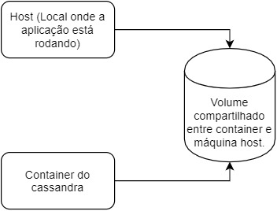

# Sistema de carga de dados via JMX para dados abertos de cnpj´s do brasil e socios

A idéia desse projeto é ler os arquivos que vem da receita federal ([Link aqui](http://receita.economia.gov.br/orientacao/tributaria/cadastros/cadastro-nacional-de-pessoas-juridicas-cnpj/dados-publicos-cnpj)), que são dados de CNPJ´s e dos sócios de todo o Brasil.

# Antes de começar
1- Antes de tudo, voce precisará baixar esse arquivos no link acima, eles são muito grandes, e levará tempo.

2- Você precisará juntar esse arquivos em apenas 1, garanta espaço em disco, para fazer isso. Se você for programador e quiser criar seu próprio FileJoiner, fica a vontade, eu usei [este File Joiner aqui](https://www.igorware.com/file-joiner), na época eu usava windows, então se você estiver usando linux, pode tentar com este [JFSplit](http://jfsplit.sourceforge.net/)

3- Após juntar os arquivos, eu rodei uma aplicação em python que processa esse arquivo gigante (~100GB) e faz a separação dos arquivos, de Empresa, Cnae Secundarias, e Socios. [Aqui está](https://github.com/fabioserpa/CNPJ-full) o link do projeto que faz a leitura e separação dos arquivos para processamento.

# Configurando ambiente

Existe 2 opções de ambiente
A primeira é tudo rodando no mesmo lugar (tanto essa aplicação, quanto o banco de dados do cassandra) a segunda opção é ter o cassandra em outro servidor (máquina virutal, container docker, ou outro servidor externo na sua rede).

No meu caso, eu utilizei o container do docker. Segue linha de comando utilizada abaixo com as portas e volumes configurados:

**Não execute esse comando até chegar no passo de iniciar o banco de dados, apenas deixe ele de prontidão em um terminal.**
``` 
docker run \
-e DSE_LICENSE=accept \
-e LOCAL_JMX=no \
-p 9042:9042 \
-p 7199:7199 \
-v <pasta_arquivos_configuração>/conf \
-v <pasta_cassandra>:/var/lib/cassandra \
-v <pasta_spark>:/var/lib/spark \
-v <pasta_efs>:/var/lib/dsefs \
-v <pasta_log_cassandra>:/var/log/cassandra \
-v <pasta_log_spark>:/var/log/spark \
--name cassandra -d datastax/dse-server:6.7
```


Altere os respectivos valores das tags pelos path da pasta.
**Obs: Esse path não pode ser referencial, precisa ser o path absoluto**

## Setando valores no application properties

Local do arquivo : **src/main/resources**
Altere os caminhos no arquivo application.properties ( )

|nome da propriedade            |valor 				          |
|-------------------------------|-----------------------------|
|`pasta.leitura.empresas`       |`Pasta onde se encontra o arquivo de empresa.csv` no meu caso /mnt/2f5d0b56-cec8-4246-b2ce-8307eda766c3/dados_receita_federal/empresa/             
|`pasta.escrita.empresas`       |`pasta onde os arquivos SSTables serão gerados` no meu caso é a <pasta_cassandra>/dadosabertos/        
|`pasta.leitura.cnaes`          | `Pasta onde se encontra o arquivo de cnaes.csv`no meu caso /mnt/2f5d0b56-cec8-4246-b2ce-8307eda766c3/dados_receita_federal/cnaes/|
|`pasta.escrita.cnaes`          | `Pasta onde os arquivos SSTables serão gerados` no meu caso é a <pasta_cassandra>/dadosabertos/ 
|`pasta.leitura.socios`         | `Pasta onde se encontra o arquivo de socios.csv` /mnt/2f5d0b56-cec8-4246-b2ce-8307eda766c3/dados_receita_federal/socios/
|`pasta.escrita.socios`         | `Pasta onde os arquivos SSTables serão gerados` <pasta_cassandra>/dadosabertos/
|`pasta.container.leitura`      | Preferencialmente deve ser mantido o valor já pré-setado. Mas pode ser alterado conforme necessidade

> **Observação importante: 
Todos os parâmetros com prefixo `pasta.escrita` deve ter o mesmo valor do parâmetro "`<pasta_cassandra>`/dadosabertos" , pois como estou fazendo load de dados via JMX, não é possível mandar arquivos via JMX para um servidor remoto e/ou container diretamente, logo, a pasta onde estão os arquivos de SSTable deve estar mapeado para um volume, onde tanto a máquina host (onde esta aplicação está rodando) quanto o servidor remoto (banco de dados) consigam acessar.
Eu criei um slink entre os diretórios  `/mnt/2f5d0b56-cec8-4246-b2ce-8307eda766c3/dados_receita_federal/sstables/` e o valor do parametro `<pasta_cassandra>` que corresponde ao path do container `/var/lib/cassandra/` onde dentro dessa pasta contém a pasta da keyspace que estamos usando `dadosabertos`. 
No meu caso, `/mnt/2f5d0b56-cec8-4246-b2ce-8307eda766c3` é o caminho que faz acesso ao meu 2º HD que possuo na minha máquina.** 
Meu ambiente está assim:



## Iniciando o banco de dados
Acesso a pasta que vc mapeou para arquivos de configuração: ***<pasta_arquivos_configuração>***

Dentro dessa pasta, insira o arquivo de cassandra-env.sh, esse arquvo está na pasta /src/main/resources do projeto devidamente alterado.

No arquivo cassandra-env.sh, você focará nas linhas:  
Linha 300: `JVM_OPTS="$JVM_OPTS -Djava.rmi.server.hostname=172.17.0.2"`  
troque o ip 172.17.0.2 pelo ip do seu container do cassandra.  
Linha 324: `JVM_OPTS="$JVM_OPTS -Dcassandra.jmx.remote.port=$JMX_PORT"`  
Linha 327: `JVM_OPTS="$JVM_OPTS -Dcom.sun.management.jmxremote.rmi.port=$JMX_PORT"`  

Por default elas vem comentadas, mas é necessário descomentá-las para acessar o container remotamente via JMX.  
A alteração realizada é para permitir conexões JMX diretamente com a instancia do cassandra.  

### Crie o Keyspace e as tabelas.
#### 1º Acesse o container do cassandra
```
docker exec -it cassandra bash
```
*`Caso queira entrar no container no modo root atribua o parametro --user root após o parametro -it`*

#### 2º Crie a keyspace
Na pasta **src/main/resources** desse projeto existe um arquivo de ddl, porém nele não tem o comando de criação da keyspace.

Após entrar no container digite **cqlsh** e aperte Enter.
Crie o keyspace:
```
create keyspace dadosabertos with replication={'class':'SimpleStrategy','replication_factor':'1'} 
```
Crie as tabelas:
`copie todo o conteudo do arquivo de ddl e cole no terminal do cassandra.`

## Iniciando a aplicação
Após todas essas configurações e com o servidor do cassandra em execução, abra um terminal na pasta do projeto onde você fez o clone,  rode o comando do `mvn clean install`.
Por fim execute:
```
java -jar target/dados-publico-cnpj-3.0-SNAPSHOT.jar
```
Se preferir, e tiver conhecimento, pode rodar a aplicação em container docker também, mas o processo de mapeamento de volumes será via volume lógico do docker e não via pasta do host como fizemos.


# Contato

Galera quem tiver qualquer dúvida sobre o funcionamento do projeto dá um toque que eu ajudo como puder

Rafael Silva Oliveira

What´s app: +55 11 9-8201-8310

Linkedin: [https://www.linkedin.com/in/rafaelso-dev/](https://www.linkedin.com/in/rafaelso-dev/)

Facebook: [https://www.facebook.com/rafaelso.dev](https://www.facebook.com/rafaelso.dev)

E-mail de contato: rafaelso.dev@gmail.com
